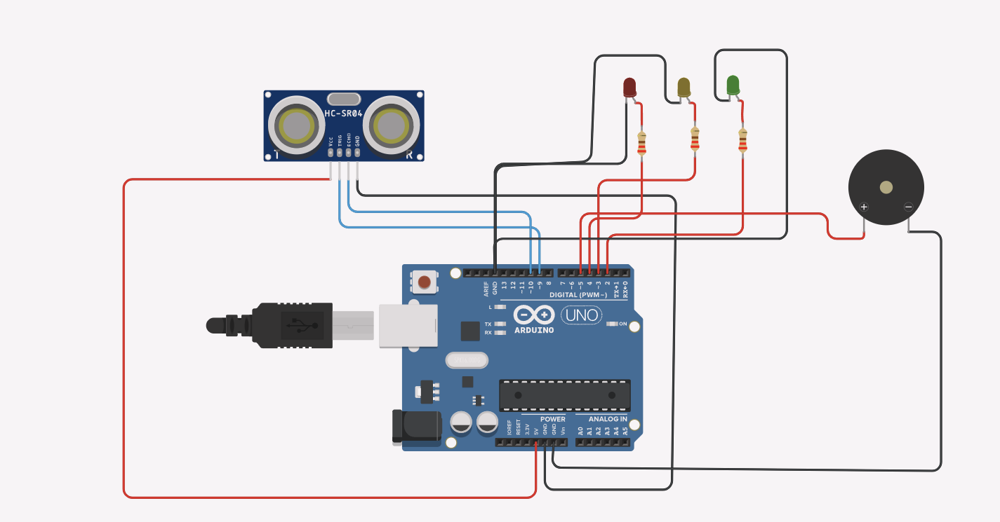
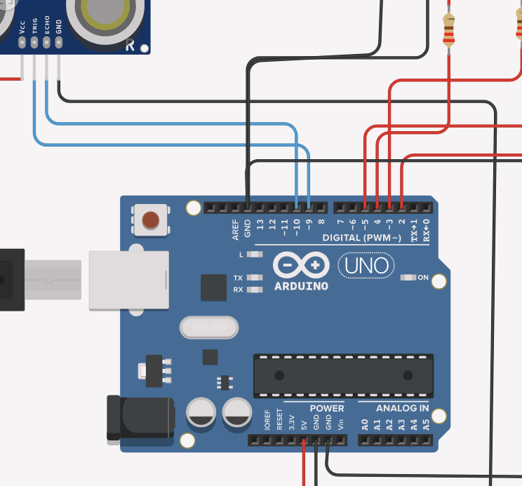
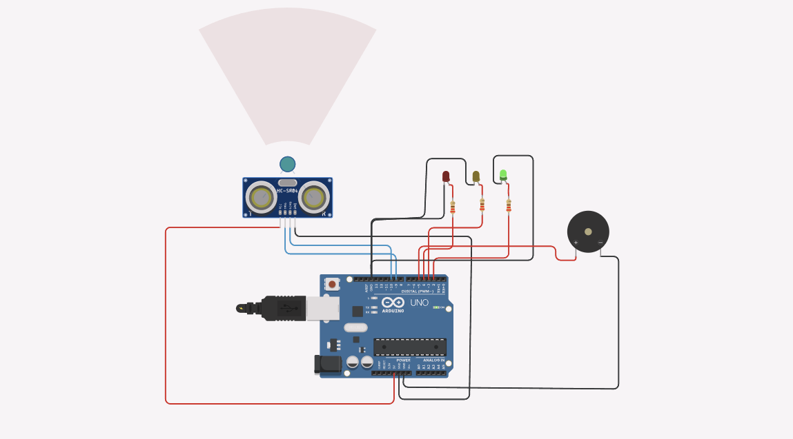

# 💧 IoT Water Level Monitoring System

## 📌 Objective

The objective of this project is to monitor the water level using an ultrasonic sensor and provide alerts using LEDs and a buzzer when the water reaches specific levels.

---

## 🧰 Components Used

* Arduino Uno
* Ultrasonic Sensor (HC-SR04)
* LEDs (Red, Yellow, Green)
* Buzzer
* Resistors
* Jumper Wires
* Breadboard

---

## 🔌 Circuit Diagram

---

## 🔗 Wiring Connections

---

## ▶️ Simulation Output

---

## ⚙️ Working Principle

The system uses an ultrasonic sensor to measure the distance between the sensor and the water surface.

* The sensor sends ultrasonic waves and receives the reflected signal.
* Based on the distance calculated:

  * **High water level** → Green LED turns ON
  * **Medium water level** → Yellow LED turns ON
  * **Low water level** → Red LED turns ON + Buzzer alerts

The Arduino processes this data and activates the respective outputs.

---

## 💻 Code

The Arduino code is available in the `code/` folder.

---

## 🚀 Features

* Real-time water level monitoring
* Visual indication using LEDs
* Audio alert using buzzer
* Simple and cost-effective design

---

## 🌍 Applications

* Water tank monitoring systems
* Smart irrigation systems
* Industrial water level control
* Home automation systems

---

## 🔮 Future Improvements

* Integration with IoT platforms (Blynk / ThingSpeak)
* Mobile app notifications
* Automatic motor control system
* Cloud data monitoring

---

